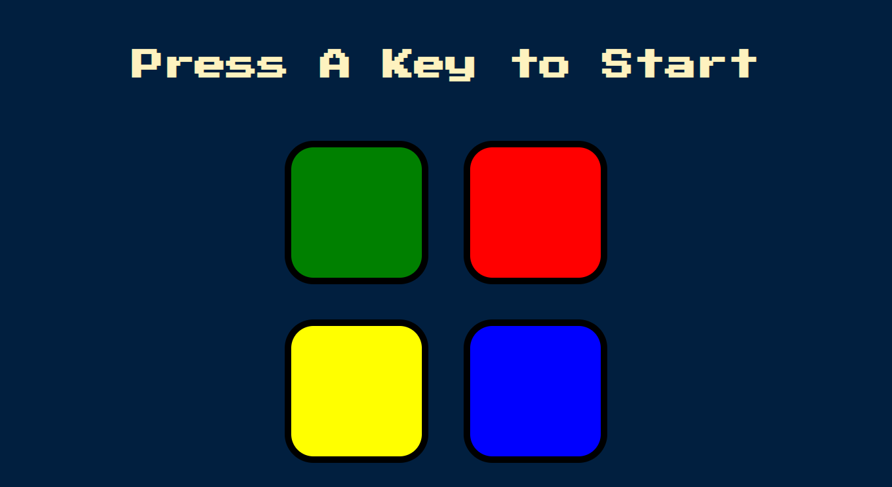

# jQuery Famous Simon Game
Simon game is one the famous game, where one of the boxes will be selected random one after another, and the player has the remember all the previous moves, the more player can remember moves, the more will be the score.
Vist the application at: https://ali-thegilfoyle.github.io/jQuery-famous-simon-game/

